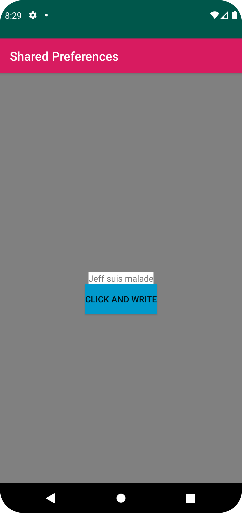
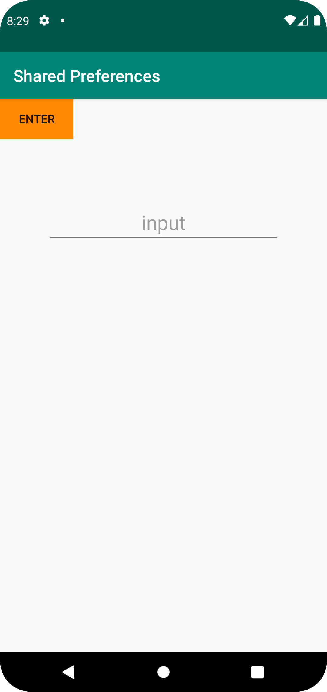

# Rapport
I det här projektet, när användaren startar applikationen (MainActivity), visas en TextView med
titeln "Delade parametrar" och en knapp märkt "Enter". När användaren trycker på knappen dirigeras
de till den andra skärmen (SecondActivity). Det finns ett EditText-fält på SecondActivity-skärmen 
där användaren kan skriva in text. När du klickar på "Enter"-knappen sparas den inmatade texten med
SharedPreferences. MainActivity hämtar den lagrade texten från SharedPreferences och visar den i 
TextView.

```
  @Override
    protected void onCreate(Bundle savedInstanceState) {
        super.onCreate(savedInstanceState);
        setContentView(R.layout.activity2);

        sharedPreferences = getSharedPreferences(data1, MODE_PRIVATE);

        button = findViewById(R.id.secondButtonsave);
        button.setOnClickListener(new View.OnClickListener() {
            @Override
            public void onClick(View view) {
                retainData();
                finish();


            }
        });
    }

```

Bilder läggs i samma mapp som markdown-filen.




